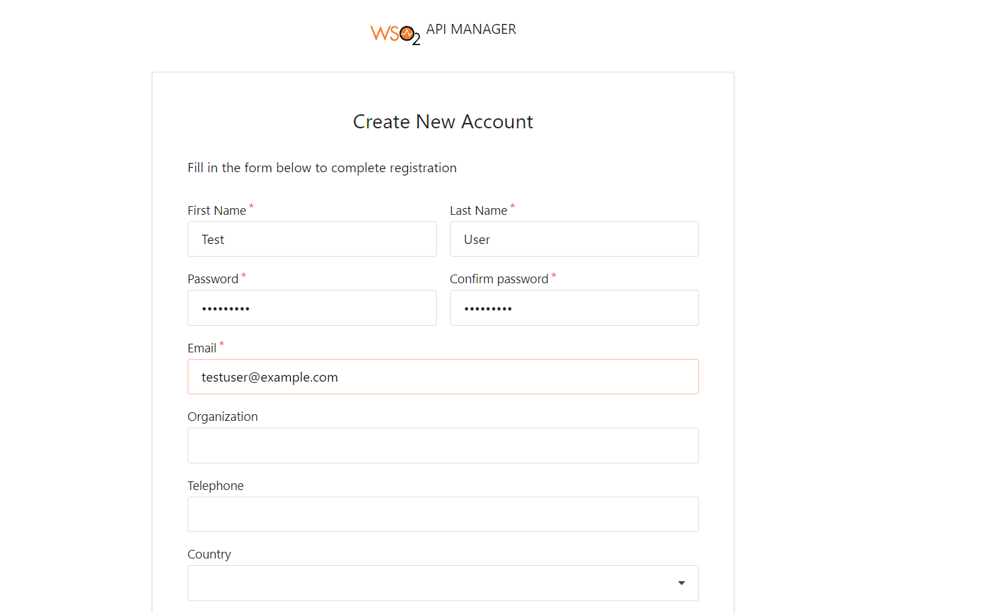
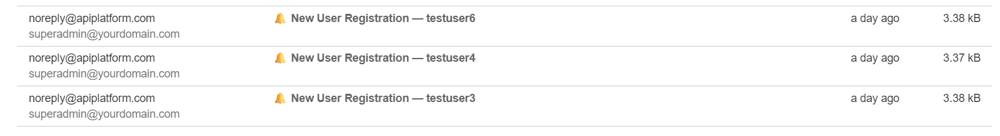

# WSO2 APIM User Signup Custom Workflow Engine

> A Spring Boot engine that intercepts WSO2 API Manager user signups, fetches user details from WSO2 Identity Server via SOAP, sends email notifications to both the new user and the admin, then approves the signup workflow back in APIM.

---

## Table of Contents

- [Overview](#overview)
- [Architecture](#architecture)
- [How It Works](#how-it-works)
- [Project Structure](#project-structure)
- [Prerequisites](#prerequisites)
- [Configuration](#configuration)
- [Running the Project](#running-the-project)
- [WSO2 APIM Configuration](#wso2-apim-configuration)
- [Email Templates](#email-templates)
- [API Reference](#api-reference)
- [Troubleshooting](#troubleshooting)
- [Tech Stack](#tech-stack)
- [Key Design Decisions](#key-design-decisions)

---

## Overview

By default, WSO2 API Manager auto-approves new Developer Portal signups silently. No one gets notified. This project replaces that behavior with a custom workflow engine that:

- **Intercepts** every new user signup event from APIM
- **Fetches** the new user's email and name from WSO2 Identity Server via SOAP
- **Sends a welcome email** to the new user confirming their account is ready
- **Fetches the admin's email** dynamically from WSO2 IS
- **Sends an alert email** to the admin with the new user's full details
- **Approves the signup** in APIM so the user becomes Active

---

## Architecture

```
┌─────────────────────────────────────────────────────────────────┐
│                    Developer Portal                             │
│              https://localhost:9443/devportal                   │
└─────────────────────────┬───────────────────────────────────────┘
                          │  User clicks Register
                          ▼
┌─────────────────────────────────────────────────────────────────┐
│                   WSO2 API Manager                              │
│         UserSignUpWSWorkflowExecutor intercepts signup          │
└─────────────────────────┬───────────────────────────────────────┘
                          │  POST /workflow/user-signup
                          ▼
┌─────────────────────────────────────────────────────────────────┐
│              Spring Boot Workflow Engine :8085                  │
│                                                                 │
│  Controller ──► returns 200 OK immediately                      │
│       │                                                         │
│       └──► @Async Background Thread                             │
│                │                                                │
│                ├── SOAP ──► WSO2 IS ──► fetch new user email    │
│                ├── SOAP ──► WSO2 IS ──► fetch admin email       │
│                ├── JavaMail ──► Welcome email to new user       │
│                ├── JavaMail ──► Alert email to admin            │
│                └── REST ──► APIM callback ──► APPROVED          │
└─────────────────────────────────────────────────────────────────┘
```

---

## How It Works

### Step-by-Step Flow

| Step | What Happens |
|------|-------------|
| 1 | Developer visits `https://localhost:9443/devportal` and fills in the registration form |
| 2 | WSO2 APIM intercepts the signup and calls your Spring Boot engine via HTTP POST |
| 3 | Controller receives the request and returns `200 OK` immediately so APIM does not timeout |
| 4 | A background thread (`@Async`) takes over and processes the workflow |
| 5 | SOAP call to WSO2 IS `RemoteUserStoreManagerService` fetches new user's email and name |
| 6 | Another SOAP call fetches the admin user's email dynamically from WSO2 IS |
| 7 | Welcome email sent to the new user via JavaMail + Thymeleaf HTML template |
| 8 | Alert email sent to the admin via JavaMail + Thymeleaf HTML template |
| 9 | REST callback to APIM `update-workflow-status` with `status: APPROVED` |
| 10 | APIM transitions the user from PENDING → ACTIVE |

### Why `@Async`?

```
Without @Async:
APIM POST ──► fetch SOAP ──► send email 1 ──► send email 2 ──► callback ──► 200 OK
             (300ms)          (500ms)           (500ms)         (300ms)     ~1600ms
                                                              APIM timeout! ❌

With @Async:
APIM POST ──► 200 OK  (instant) ✅
                └──► [background thread]
                        fetch SOAP ──► send emails ──► callback
```

### Failure Handling Philosophy

| Step | Failure Behaviour |
|------|-----------------|
| SOAP fetch user email | Log warning, skip user email, still approve |
| Send user welcome email | Log warning, continue to admin email, still approve |
| SOAP fetch admin email | Use fallback email from `application.yml` |
| Send admin alert email | Log warning, still approve |
| APIM approval callback | Log `CRITICAL` — user stays PENDING until manual intervention |

> Email is a **notification**. It should never block a user from signing up.

---

## Project Structure

```
user-signup-workflow/
│
├── pom.xml
├── docker-compose.yml                          ← MailHog only
│
└── src/main/
    ├── java/com/example/usersignupworkflow/
    │   │
    │   ├── UserSignupWorkflowApplication.java  ← Main class + @EnableAsync
    │   │
    │   ├── config/
    │   │   └── AppConfig.java                  ← SSL-bypass RestTemplate + thread pool
    │   │
    │   ├── controller/
    │   │   └── UserSignupController.java        ← POST /workflow/user-signup
    │   │
    │   ├── model/
    │   │   ├── WorkflowRequest.java             ← Deserializes APIM payload
    │   │   └── ScimUserResponse.java            ← User model built from SOAP claims
    │   │
    │   └── service/
    │       ├── UserSignupWorkflowService.java   ← @Async orchestrator
    │       ├── WsoUserService.java              ← SOAP calls to WSO2 IS
    │       ├── EmailService.java                ← Thymeleaf + JavaMail
    │       └── ApimCallbackService.java         ← Approval callback to APIM
    │
    └── resources/
        ├── application.yml
        └── templates/
            ├── user-signup-success.html         ← Welcome email to new user
            └── admin-new-user-alert.html        ← Alert email to admin
```

---

## Prerequisites

| Requirement | Version | Notes |
|-------------|---------|-------|
| Java | 17+ | Required to run Spring Boot |
| Maven | 3.6+ | Required to build the project |
| WSO2 API Manager | 4.2.0 | Running on port 9443 |
| Docker Desktop | 20.x+ | Required to run MailHog via Docker Compose |

### Check Docker is Installed

```bash
docker --version
docker compose version
```

Expected output:
```
Docker version 27.x.x
Docker Compose version v2.x.x
```

> **Important:** Use `docker compose` (no hyphen). Docker Desktop ships with Compose v2.
> The old `docker-compose` command is not available in Docker Desktop.

---

## Configuration

### `application.yml`

```yaml
server:
  port: 8085

wso2:
  is:
    host: https://localhost:9443
    admin-username: admin
    admin-password: admin
  apim:
    host: https://localhost:9443
    admin-username: admin
    admin-password: admin
    workflow-callback-url: ${wso2.apim.host}/api/am/admin/v4/workflows/update-workflow-status

app:
  admin-email: admin@yourdomain.com      # Fallback if IS lookup fails
  portal-url: http://localhost:9443/devportal

spring:
  mail:
    host: localhost
    port: 1025                           # MailHog SMTP port
    properties:
      mail:
        smtp:
          auth: false
          starttls:
            enable: false

  thymeleaf:
    prefix: classpath:/templates/
    suffix: .html
    cache: false

logging:
  level:
    com.example.usersignupworkflow: DEBUG
```

### For Production (Real Gmail SMTP)

When you are ready to send real emails, replace the `spring.mail` section:

```yaml
spring:
  mail:
    host: smtp.gmail.com
    port: 587
    username: ${MAIL_USERNAME}
    password: ${MAIL_PASSWORD}           # Use Gmail App Password
    properties:
      mail:
        smtp:
          auth: true
          starttls:
            enable: true
```

> Generate a Gmail App Password at:
> `Google Account → Security → 2-Step Verification → App Passwords`

---

## Running the Project

### Services Overview

This project uses three services that must all be running at the same time:

```
┌─────────────────────────────────────────────────────────┐
│  Service          How to Run         Port               │
├─────────────────────────────────────────────────────────┤
│  WSO2 APIM        Locally            9443               │
│  MailHog          Docker Compose     1025 (SMTP)        │
│                                      8025 (Web UI)      │
│  Spring Boot      mvn spring-boot:run  8085             │
└─────────────────────────────────────────────────────────┘
```

---

### Step 1 — Start WSO2 API Manager

```bash
cd <APIM_HOME>/bin

# Windows
.\api-manager.bat

# Linux / Mac
./api-manager.sh
```

Wait until you see:

```
[SERVER STARTED]
Mgt Console URL : https://localhost:9443/carbon
```

This takes approximately 2 to 3 minutes on first start.

---

### Step 2 — Start MailHog with Docker Compose

MailHog is the local fake SMTP server. Docker Compose spins it up in one command.

Your `docker-compose.yml`:

```yaml
services:
  mailhog:
    image: mailhog/mailhog:latest
    container_name: mailhog
    ports:
      - "1025:1025"
      - "8025:8025"
    restart: unless-stopped
```

Start it:

```bash
docker compose up -d
```

Verify it is running:

```bash
docker compose ps
```

Expected output:

```
NAME        IMAGE                    STATUS    PORTS
mailhog     mailhog/mailhog:latest   Up        0.0.0.0:1025->1025, 0.0.0.0:8025->8025
```

Open the MailHog web UI in your browser:

```
http://localhost:8025
```

You should see an empty inbox — ready to catch emails.

#### What MailHog Does

MailHog is a **fake SMTP server** for local development. It catches all emails sent to port `1025` and displays them in its web UI at port `8025`. No real emails are sent to actual inboxes. This makes it completely safe for development and testing.

```
Spring Boot engine
    sends email via SMTP → localhost:1025
                                  ↓
                             MailHog catches it
                                  ↓
                     View at http://localhost:8025
                     (never forwarded to real inbox)
```

#### Docker Compose Commands Reference

```bash
# Start MailHog in background
docker compose up -d

# Stop MailHog
docker compose down

# Check if running
docker compose ps

# View MailHog logs
docker compose logs mailhog

# View logs in real time
docker compose logs -f mailhog

# Restart MailHog
docker compose restart mailhog
```

---

### Step 3 — Start Spring Boot Engine

```bash
cd user-signup-workflow
mvn spring-boot:run
```

Wait until you see:

```
Started UserSignupWorkflowApplication on port 8085
```

---

### Startup Order Summary

```
1. WSO2 APIM          ← start first   (2-3 minutes to fully start)
        ↓
2. MailHog            ← start second  (instant via docker compose up -d)
        ↓
3. Spring Boot        ← start third   (5 seconds via mvn spring-boot:run)
```

---

### Verify All Services Are Running

Open each of these in your browser:

| Service | URL | Expected Result |
|---------|-----|-----------------|
| WSO2 Dev Portal | `https://localhost:9443/devportal` | Developer portal homepage |
| WSO2 Carbon Console | `https://localhost:9443/carbon` | Admin login page |
| MailHog Web UI | `http://localhost:8025` | Empty inbox, ready |
| Spring Boot Engine | `http://localhost:8085` | Returns 405 (alive — POST only) |

---

## WSO2 APIM Configuration

### Edit `workflow-extensions.xml`

Location:

```
<APIM_HOME>/repository/deployment/server/webapps/
  api#am#admin#v4/WEB-INF/classes/workflow-extensions.xml
```

Find the `<UserSignUp>` block and replace it:

**Before (default — silent auto-approval):**

```xml
<UserSignUp executor="org.wso2.carbon.apimgt.impl.workflow.UserSignUpSimpleWorkflowExecutor"/>
```

**After (custom workflow engine):**

```xml
<UserSignUp
    executor="org.wso2.carbon.apimgt.impl.workflow.UserSignUpWSWorkflowExecutor">
    <Property name="serviceEndpoint">
        http://localhost:8085/workflow/user-signup
    </Property>
    <Property name="username">admin</Property>
    <Property name="password">admin</Property>
    <Property name="contentType">application/json</Property>
</UserSignUp>
```

> **No APIM restart needed** — WSO2 hot-reloads `workflow-extensions.xml` at runtime.
> Changes take effect immediately after saving the file.

### Set Admin Email in Carbon

The engine fetches the admin email dynamically from WSO2 IS. You must set it first:

```
https://localhost:9443/carbon
→ Home → Users and Roles → Users → List
→ Click admin → User Profile
→ Set Email field to your email address
→ Click Update
```

Once set, every signup notification goes to this email. If you change it in Carbon, the next signup automatically uses the new address — no config change needed.

---

## Testing End-to-End

### Register a New User

1. Open `https://localhost:9443/devportal`
2. Click **Sign In** (top right corner)
3. Click **Register**
4. Fill in the form:

```
First Name : Test
Last Name  : User
Username   : testuser
Email      : testuser@example.com
Password   : Test@1234
```

5. Click **Register**

### Watch the Spring Boot Logs

Immediately after clicking Register, switch to your Spring Boot terminal window. You should see:

```
==> Received user signup workflow request
    workflowReference : xxxxxxxx-xxxx-xxxx-xxxx-xxxxxxxxxxxx
    username          : testuser
    tenantDomain      : carbon.super

=====================================================
Processing signup workflow
=====================================================
Fetching user via SOAP — username: testuser
SOAP claims — email: testuser@example.com, firstName: Test, lastName: User
User resolved — name: Test User, email: testuser@example.com
Signup success email sent → testuser@example.com
Fetching admin email from WSO2 IS via SOAP
Admin email resolved: admin@yourdomain.com
Admin alert email sent → admin@yourdomain.com
APIM callback URL : https://localhost:9443/.../update-workflow-status?workflowReferenceId=xxx
APIM callback success — HTTP: 200 OK
Signup approved in APIM — ref: xxxxxxxx-...
=====================================================
Workflow complete for: testuser
=====================================================
```


### Check MailHog for Emails

Open `http://localhost:8025`

You should see two emails:

```
┌──────────────────────────────────────────────────────────────────┐
│  From                    Subject                                 │
├──────────────────────────────────────────────────────────────────┤
│  noreply@apiplatform     🎉 Welcome! Your Developer Portal...    │
│  noreply@apiplatform     🔔 New User Registration — testuser     │
└──────────────────────────────────────────────────────────────────┘
```

Click either email to see the fully rendered HTML template.

### Verify User is Active in Carbon

```
https://localhost:9443/carbon
→ Home → Users and Roles → Users → List
→ Find testuser → Status should be Active ✅
```

---

## Email Templates

### Welcome Email — `user-signup-success.html`

Sent to the new user after successful signup.

**Variables injected by Thymeleaf:**

| Variable | Source | Example Value |
|----------|--------|---------------|
| `${fullName}` | SOAP claim: givenname + lastname | Test User |
| `${username}` | APIM payload: userName | testuser |
| `${signupDate}` | LocalDateTime.now() at processing time | 2026-06-03 10:30:00 |
| `${portalUrl}` | application.yml: app.portal-url | http://localhost:9443/devportal |

### Admin Alert Email — `admin-new-user-alert.html`

Sent to the admin when a new user registers.

**Variables injected by Thymeleaf:**

| Variable | Source | Example Value |
|----------|--------|---------------|
| `${fullName}` | SOAP claim: givenname + lastname | Test User |
| `${username}` | APIM payload: userName | testuser |
| `${userEmail}` | SOAP claim: emailaddress | testuser@example.com |
| `${tenantDomain}` | APIM payload: tenantDomain | carbon.super |
| `${signupDate}` | LocalDateTime.now() at processing time | 2026-06-03 10:30:00 |

---

## API Reference

### `POST /workflow/user-signup`

Receives the signup event from WSO2 APIM.

**Request Body (sent by APIM):**

```json
{
  "UserSignupProcessRequest": {
    "userName": "john_doe",
    "tenantDomain": "carbon.super",
    "workflowExternalRef": "895a4631-3f2a-4b1c-9d8e-abc123",
    "callBackURL": "?"
  }
}
```

**Response:**

```
HTTP 200 OK
Workflow received. Processing in background.
```

**APIM Approval Callback (sent back to APIM after processing):**

```
POST /api/am/admin/v4/workflows/update-workflow-status
     ?workflowReferenceId=895a4631-3f2a-4b1c-9d8e-abc123

Body:
{
  "status": "APPROVED",
  "description": "User signup approved. Email notifications sent."
}
```

---

## Troubleshooting

| Symptom | Cause | Fix |
|---------|-------|-----|
| No logs in Spring Boot when user registers | Wrong `serviceEndpoint` in `workflow-extensions.xml` | Verify engine is on port 8085, check the URL in xml |
| `workflowReference` is null in logs | APIM version sends different payload structure | Temporarily log `@RequestBody String rawBody` to see actual JSON |
| SCIM2 returns Carbon login HTML | APIM 4.2 CSRF protection blocks Basic Auth on SCIM2 | Use SOAP `RemoteUserStoreManagerService` — already implemented |
| APIM callback `400 Bad Request` | `workflowReferenceId` must be URL query param not body field | Verify `ApimCallbackService` uses `UriComponentsBuilder.queryParam()` |
| User stays PENDING after signup | APIM callback failed | Check logs for `CRITICAL` keyword, verify callback URL and credentials |
| No emails appear in MailHog | MailHog container not running on port 1025 | Run `docker compose up -d`, verify `docker compose ps` |
| MailHog web UI not opening | Port 8025 not exposed | Check `docker compose ps`, restart with `docker compose restart mailhog` |
| Admin email uses fallback value | Admin user has no email set in Carbon | Go to Carbon → Users → admin → User Profile → set Email |
| SSL handshake exception on WSO2 calls | WSO2 self-signed certificate not trusted | `AppConfig.java` SSL-bypass `RestTemplate` handles this automatically |
| `@Async` runs synchronously | `@EnableAsync` missing from main class | Add `@EnableAsync` to `UserSignupWorkflowApplication.java` |
| `docker-compose` command not found | Docker Compose v1 not installed | Use `docker compose` without the hyphen — Compose v2 syntax |
| Docker Desktop virtualization error | Hardware virtualization disabled | Enable Intel VT-x or AMD-V in BIOS settings and restart |

---

## SOAP Approach — Why Not SCIM2?

WSO2 APIM 4.2 has CSRF protection that redirects SCIM2 Basic Auth requests to the Carbon login page. OAuth Bearer tokens on SCIM2 return `403 Forbidden` even with `internal_user_mgt_view` scope.

**What was tried:**

| Attempt | Result | Reason |
|---------|--------|--------|
| SCIM2 with Basic Auth | Returns Carbon login HTML (200 OK) | CSRF filter redirects to login page |
| SCIM2 with Bearer Token | 403 Forbidden | DCR client lacks IS admin permissions |
| SCIM2 with all IS scopes | 403 Forbidden | IS role assignment required, scope alone not enough |
| SOAP RemoteUserStoreManagerService | 200 OK with full user data ✅ | Bypasses CSRF, accepts Basic Auth directly |

**The solution — SOAP Carbon Admin Service:**

```
POST /services/RemoteUserStoreManagerService
Authorization: Basic YWRtaW46YWRtaW4=
SOAPAction: urn:getUserClaimValues

Response claims extracted:
  http://wso2.org/claims/emailaddress  → user@example.com
  http://wso2.org/claims/givenname    → John
  http://wso2.org/claims/lastname     → Doe
```

---

## Tech Stack

| Technology | Version | Purpose |
|------------|---------|---------|
| Spring Boot | 3.3.0 | Application framework |
| Spring Web | Included | REST endpoint + RestTemplate |
| Spring Mail + JavaMail | Included | Email sending via SMTP |
| Thymeleaf | Included | HTML email template rendering |
| Apache HttpClient 5 | Included | SSL-bypass RestTemplate for WSO2 self-signed certs |
| Lombok | Included | Boilerplate reduction |
| WSO2 API Manager | 4.2.0 | API gateway — triggers the signup workflow |
| WSO2 IS (embedded) | 4.2.0 | Identity Server — user store accessed via SOAP |
| MailHog | Latest | Local fake SMTP server for email testing |
| Docker | 20.x+ | Runs MailHog container |
| Docker Compose | v2.x+ | Manages MailHog with `docker compose up -d` |

---

## Key Design Decisions

| Decision | Reason |
|----------|--------|
| `@Async` processing | APIM expects `200 OK` in milliseconds — processing in background thread prevents timeout |
| SOAP over SCIM2 | SCIM2 blocked by CSRF protection in APIM 4.2; SOAP works reliably with Basic Auth |
| Dynamic admin email from IS | Admin email fetched from WSO2 IS profile — no hardcoded config needed |
| Email failures non-blocking | Notification failure should never prevent a user from completing signup |
| SSL bypass RestTemplate | WSO2 uses self-signed certificates locally — standard RestTemplate fails SSL handshake |
| `workflowReferenceId` as query param | APIM Admin API v4 requires this as a URL query parameter, not in the request body |
| Docker only for MailHog | Spring Boot and APIM run locally — Docker used purely to run MailHog without installation |
| `version` removed from docker-compose.yml | Docker Compose v2 treats `version` as obsolete — omitting it removes the warning |

---

*Built for WSO2 API Manager 4.2.0 — Spring Boot 3.3 — Java 17 — Docker Compose v2*
