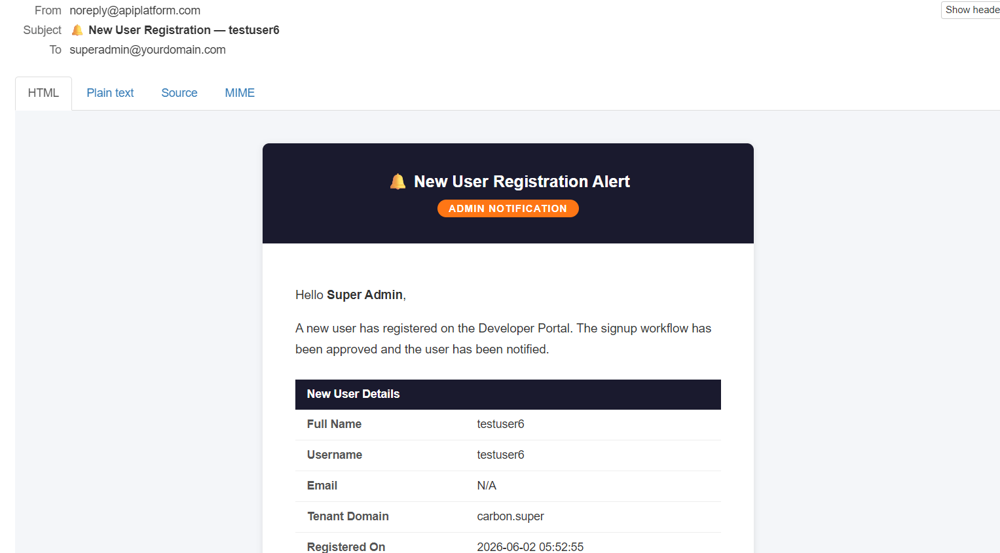
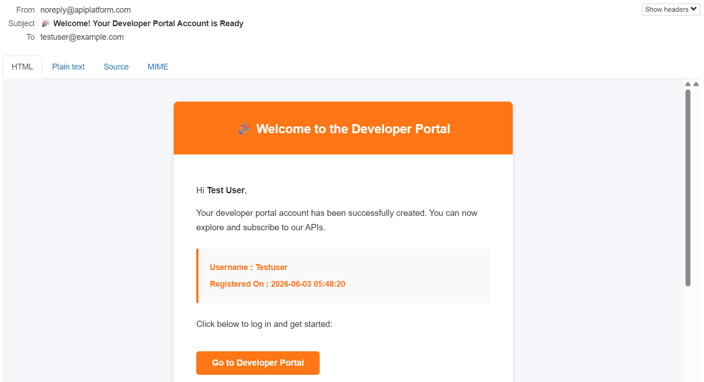

# WSO2 APIM User Signup Custom Workflow Engine

> A Spring Boot engine that intercepts WSO2 API Manager user signups, fetches user details from WSO2 Identity Server via SOAP, sends email notifications to both the new user and the admin, then approves the signup workflow back in APIM.

---

## Table of Contents

- [Overview](#overview)
- [Architecture](#architecture)
- [How It Works](#how-it-works)
- [Project Structure](#project-structure)
- [Prerequisites](#prerequisites)
- [Configuration](#configuration)
- [Running the Project](#running-the-project)
- [WSO2 APIM Configuration](#wso2-apim-configuration)
- [Email Templates](#email-templates)
- [API Reference](#api-reference)
- [Troubleshooting](#troubleshooting)
- [Tech Stack](#tech-stack)

---

## Overview

By default, WSO2 API Manager auto-approves new Developer Portal signups silently. No one gets notified. This project replaces that behavior with a custom workflow engine that:

- **Intercepts** every new user signup event from APIM
- **Fetches** the new user's email and name from WSO2 Identity Server via SOAP
- **Sends a welcome email** to the new user confirming their account is ready
- **Fetches the admin's email** dynamically from WSO2 IS
- **Sends an alert email** to the admin with the new user's full details
- **Approves the signup** in APIM so the user becomes Active

---

## Architecture

```
┌─────────────────────────────────────────────────────────────────┐
│                    Developer Portal                             │
│              https://localhost:9443/devportal                   │
└─────────────────────────┬───────────────────────────────────────┘
                          │  User clicks Register
                          ▼
┌─────────────────────────────────────────────────────────────────┐
│                   WSO2 API Manager                              │
│         UserSignUpWSWorkflowExecutor intercepts signup          │
└─────────────────────────┬───────────────────────────────────────┘
                          │  POST /workflow/user-signup
                          ▼
┌─────────────────────────────────────────────────────────────────┐
│              Spring Boot Workflow Engine :8085                  │
│                                                                 │
│  Controller ──► returns 200 OK immediately                      │
│       │                                                         │
│       └──► @Async Background Thread                             │
│                │                                                │
│                ├── SOAP ──► WSO2 IS ──► fetch new user email    │
│                ├── SOAP ──► WSO2 IS ──► fetch admin email       │
│                ├── JavaMail ──► Welcome email to new user       │
│                ├── JavaMail ──► Alert email to admin            │
│                └── REST ──► APIM callback ──► APPROVED          │
└─────────────────────────────────────────────────────────────────┘
```

---

## How It Works

### Step-by-Step Flow

| Step | What Happens |
|------|-------------|
| 1 | Developer visits `https://localhost:9443/devportal` and fills in the registration form |
| 2 | WSO2 APIM intercepts the signup and calls your Spring Boot engine via HTTP POST |
| 3 | Controller receives the request and returns `200 OK` immediately so APIM does not timeout |
| 4 | A background thread (`@Async`) takes over and processes the workflow |
| 5 | SOAP call to WSO2 IS `RemoteUserStoreManagerService` fetches new user's email and name |
| 6 | Another SOAP call fetches the admin user's email dynamically from WSO2 IS |
| 7 | Welcome email sent to the new user via JavaMail + Thymeleaf HTML template |
| 8 | Alert email sent to the admin via JavaMail + Thymeleaf HTML template |
| 9 | REST callback to APIM `update-workflow-status` with `status: APPROVED` |
| 10 | APIM transitions the user from PENDING → ACTIVE |

### Why `@Async`?

```
Without @Async:
APIM POST ──► fetch SOAP ──► send email 1 ──► send email 2 ──► callback ──► 200 OK
             (300ms)          (500ms)           (500ms)         (300ms)     ~1600ms
                                                              APIM timeout! ❌

With @Async:
APIM POST ──► 200 OK  (instant) ✅
                └──► [background thread]
                        fetch SOAP ──► send emails ──► callback
```

### Failure Handling Philosophy

| Step | Failure Behaviour |
|------|-----------------|
| SOAP fetch user email | Log warning, skip user email, still approve |
| Send user welcome email | Log warning, continue to admin email, still approve |
| SOAP fetch admin email | Use fallback email from `application.yml` |
| Send admin alert email | Log warning, still approve |
| APIM approval callback | Log `CRITICAL` — user stays PENDING until manual intervention |

> Email is a **notification**. It should never block a user from signing up.

---

## Project Structure

```
user-signup-workflow/
│
├── pom.xml
│
└── src/main/
    ├── java/com/example/usersignupworkflow/
    │   │
    │   ├── UserSignupWorkflowApplication.java     ← Main class + @EnableAsync
    │   │
    │   ├── config/
    │   │   └── AppConfig.java                     ← SSL-bypass RestTemplate + thread pool
    │   │
    │   ├── controller/
    │   │   └── UserSignupController.java           ← POST /workflow/user-signup
    │   │
    │   ├── model/
    │   │   ├── WorkflowRequest.java                ← Deserializes APIM payload
    │   │   └── ScimUserResponse.java               ← User model built from SOAP claims
    │   │
    │   └── service/
    │       ├── UserSignupWorkflowService.java      ← @Async orchestrator
    │       ├── WsoUserService.java                 ← SOAP calls to WSO2 IS
    │       ├── EmailService.java                   ← Thymeleaf + JavaMail
    │       └── ApimCallbackService.java            ← Approval callback to APIM
    │
    └── resources/
        ├── application.yml
        └── templates/
            ├── user-signup-success.html            ← Welcome email to new user
            └── admin-new-user-alert.html           ← Alert email to admin
```

---

## Prerequisites

| Requirement | Version | Notes |
|-------------|---------|-------|
| Java | 17+ | |
| Maven | 3.6+ | |
| WSO2 API Manager | 4.2.0 | Running on port 9443 |
| MailHog | Latest | For local email testing |

### Install MailHog (Local Email Testing)

Download the Windows executable from:
```
https://github.com/mailhog/MailHog/releases/latest
```

Download `MailHog_windows_amd64.exe` and run it directly — no installation needed.

---

## Configuration

### `application.yml`

```yaml
server:
  port: 8085

wso2:
  is:
    host: https://localhost:9443
    admin-username: admin
    admin-password: admin
  apim:
    host: https://localhost:9443
    admin-username: admin
    admin-password: admin
    workflow-callback-url: ${wso2.apim.host}/api/am/admin/v4/workflows/update-workflow-status

app:
  admin-email: admin@yourdomain.com      # Fallback if IS lookup fails
  portal-url: http://localhost:9443/devportal

spring:
  mail:
    host: localhost
    port: 1025                           # MailHog SMTP port
    properties:
      mail:
        smtp:
          auth: false
          starttls:
            enable: false

  thymeleaf:
    prefix: classpath:/templates/
    suffix: .html
    cache: false

logging:
  level:
    com.example.usersignupworkflow: DEBUG
```

### For Production (Real Gmail SMTP)

```yaml
spring:
  mail:
    host: smtp.gmail.com
    port: 587
    username: ${MAIL_USERNAME}
    password: ${MAIL_PASSWORD}           # Use Gmail App Password
    properties:
      mail:
        smtp:
          auth: true
          starttls:
            enable: true
```

> Generate a Gmail App Password at: `Google Account → Security → 2-Step Verification → App Passwords`

---

## Running the Project

### Step 1 — Start WSO2 API Manager

```bash
cd <APIM_HOME>/bin
./api-manager.bat         # Windows
./api-manager.sh          # Linux/Mac
```

Wait for:
```
[SERVER STARTED]
Mgt Console URL : https://localhost:9443/carbon
```

### Step 2 — Start MailHog

```bash
MailHog_windows_amd64.exe
```

Wait for:
```
[SMTP] Binding to address: 0.0.0.0:1025
[HTTP] Binding to address: 0.0.0.0:8025
```

Open MailHog UI: `http://localhost:8025`

### Step 3 — Start Spring Boot Engine

```bash
cd user-signup-workflow
mvn spring-boot:run
```

Wait for:
```
Started UserSignupWorkflowApplication on port 8085
```

### Startup Order

```
1. WSO2 APIM     ← start first  (takes 2-3 minutes)
2. MailHog       ← start second (instant)
3. Spring Boot   ← start third  (5 seconds)
```

### Verify All Services

| Service | URL | Expected |
|---------|-----|----------|
| WSO2 Dev Portal | `https://localhost:9443/devportal` | Portal homepage |
| WSO2 Carbon Console | `https://localhost:9443/carbon` | Login page |
| MailHog UI | `http://localhost:8025` | Empty inbox |
| Spring Boot | `http://localhost:8085` | Running (405 on GET) |

---

## WSO2 APIM Configuration

### Edit `workflow-extensions.xml`

Location:
```
<APIM_HOME>/repository/deployment/server/webapps/
  api#am#admin#v4/WEB-INF/classes/workflow-extensions.xml
```

Find the `<UserSignUp>` block and replace it:

**Before (default):**
```xml
<UserSignUp executor="org.wso2.carbon.apimgt.impl.workflow.UserSignUpSimpleWorkflowExecutor"/>
```

**After (custom workflow):**
```xml
<UserSignUp
    executor="org.wso2.carbon.apimgt.impl.workflow.UserSignUpWSWorkflowExecutor">
    <Property name="serviceEndpoint">
        http://localhost:8085/workflow/user-signup
    </Property>
    <Property name="username">admin</Property>
    <Property name="password">admin</Property>
    <Property name="contentType">application/json</Property>
</UserSignUp>
```

> **No APIM restart needed** — WSO2 hot-reloads `workflow-extensions.xml` at runtime.

### Set Admin Email in Carbon

```
https://localhost:9443/carbon
→ Home → Users and Roles → Users → List → admin → User Profile
→ Set Email field → Save
```

The engine fetches the admin's email dynamically from this profile on every signup.

---

## Testing End-to-End

### Register a New User

1. Go to `https://localhost:9443/devportal`
2. Click **Sign In → Register**
3. Fill in:
   ```
   First Name : Test
   Last Name  : User
   Username   : testuser
   Email      : testuser@example.com
   Password   : Test@1234
   ```
   
4. Click **Register**

### Expected Spring Boot Logs

```
==> Received user signup workflow request
    workflowReference : xxxxxxxx-xxxx-xxxx-xxxx-xxxxxxxxxxxx
    username          : testuser
    tenantDomain      : carbon.super

=====================================================
Processing signup workflow
=====================================================
Fetching user via SOAP — username: testuser
SOAP claims — email: testuser@example.com, firstName: Test, lastName: User
User resolved — name: Test User, email: testuser@example.com
Signup success email sent → testuser@example.com
Fetching admin email from WSO2 IS via SOAP
Admin email resolved: admin@yourdomain.com
Admin alert email sent → admin@yourdomain.com
APIM callback URL : https://localhost:9443/.../update-workflow-status?workflowReferenceId=xxx
APIM callback success — HTTP: 200 OK
Signup approved in APIM — ref: xxxxxxxx-...
=====================================================
Workflow complete for: testuser
=====================================================
```

### Expected MailHog Emails

Open `http://localhost:8025`:

```
┌──────────────────────────────────────────────────────────────────┐
│  From                    Subject                                 │
├──────────────────────────────────────────────────────────────────┤
│  noreply@apiplatform     🎉 Welcome! Your Developer Portal...    │
│  noreply@apiplatform     🔔 New User Registration — testuser     │
└──────────────────────────────────────────────────────────────────┘
```




### Verify User is Active

```
https://localhost:9443/carbon
→ Home → Users and Roles → Users → List
→ Find testuser → Status: Active ✅
```

---

## Email Templates

### Welcome Email — `user-signup-success.html`

Sent to the new user after successful signup.

**Variables:**

| Variable | Description |
|----------|-------------|
| `${fullName}` | User's full name from WSO2 IS |
| `${username}` | Their WSO2 username |
| `${signupDate}` | Registration timestamp |
| `${portalUrl}` | Dev Portal URL for CTA button |

### Admin Alert Email — `admin-new-user-alert.html`

Sent to the admin when a new user registers.

**Variables:**

| Variable | Description |
|----------|-------------|
| `${fullName}` | New user's full name |
| `${username}` | New user's username |
| `${userEmail}` | New user's email address |
| `${tenantDomain}` | Tenant domain (e.g. `carbon.super`) |
| `${signupDate}` | Registration timestamp |

---

## API Reference

### `POST /workflow/user-signup`

Receives the signup event from WSO2 APIM.

**Request Body (sent by APIM):**
```json
{
  "UserSignupProcessRequest": {
    "userName": "john_doe",
    "tenantDomain": "carbon.super",
    "workflowExternalRef": "895a4631-3f2a-4b1c-9d8e-abc123",
    "callBackURL": "?"
  }
}
```

**Response:**
```
HTTP 200 OK
Workflow received. Processing in background.
```

**APIM Callback (sent back to APIM):**
```
POST /api/am/admin/v4/workflows/update-workflow-status?workflowReferenceId={ref}
Body: { "status": "APPROVED", "description": "..." }
```

---

## Troubleshooting

| Symptom | Cause | Fix |
|---------|-------|-----|
| No logs in Spring Boot on signup | Wrong `serviceEndpoint` in `workflow-extensions.xml` | Check IP/port, ensure engine is reachable from APIM |
| `workflowReference` is null | APIM version sends different payload structure | Log raw body to inspect actual JSON |
| SCIM2 returning HTML login page | WSO2 APIM 4.2 CSRF protection blocks Basic Auth on SCIM2 | Use SOAP `RemoteUserStoreManagerService` instead |
| APIM callback `400 Bad Request` | Wrong field name or missing `workflowReferenceId` query param | Check Swagger at `/api/am/admin/v4/swagger.yaml` |
| User stays PENDING | APIM callback failed | Check `CRITICAL` log, verify callback URL and credentials |
| No emails in MailHog | MailHog not running on port 1025 | Run `MailHog_windows_amd64.exe`, verify port 1025 |
| Admin email shows fallback value | Admin user has no email set in Carbon | Set email at Carbon → Users → admin → User Profile |
| SSL handshake error | Self-signed cert on WSO2 | `AppConfig.java` SSL-bypass `RestTemplate` handles this |
| `@Async` runs synchronously | `@EnableAsync` missing from main class | Add `@EnableAsync` to `UserSignupWorkflowApplication` |

---

## SOAP Approach — Why Not SCIM2?

WSO2 APIM 4.2 has CSRF protection that redirects SCIM2 Basic Auth requests to the Carbon login page. OAuth Bearer tokens on SCIM2 return `403 Forbidden` even with `internal_user_mgt_view` scope.

The solution is to use the **WSO2 Carbon SOAP API** (`RemoteUserStoreManagerService`) which accepts Basic Auth reliably and returns all user claim values including email, first name, and last name.

```
SOAP Request:
POST /services/RemoteUserStoreManagerService
Authorization: Basic YWRtaW46YWRtaW4=
SOAPAction: urn:getUserClaimValues

Response claims extracted:
  http://wso2.org/claims/emailaddress  → user@example.com
  http://wso2.org/claims/givenname    → John
  http://wso2.org/claims/lastname     → Doe
```

---

## Tech Stack

| Technology | Purpose |
|------------|---------|
| Spring Boot 3.2 | Application framework |
| Spring Web | REST endpoint (`/workflow/user-signup`) |
| Spring Mail + JavaMail | Email sending |
| Thymeleaf | HTML email templating |
| Apache HttpClient 5 | SSL-bypass `RestTemplate` for WSO2 self-signed certs |
| Lombok | Boilerplate reduction |
| WSO2 APIM 4.2 | API Manager — triggers the workflow |
| WSO2 IS (embedded) | Identity Server — user store via SOAP |
| MailHog | Local SMTP server for email testing |

---

## Key Design Decisions

| Decision | Reason |
|----------|--------|
| `@Async` processing | APIM expects `200 OK` in milliseconds — processing in background thread prevents timeout |
| SOAP over SCIM2 | SCIM2 blocked by CSRF protection in APIM 4.2; SOAP works reliably with Basic Auth |
| Dynamic admin email from IS | Admin email fetched from WSO2 IS profile — no hardcoded config needed |
| Email failures non-blocking | Notification failure should never prevent a user from completing signup |
| SSL bypass RestTemplate | WSO2 uses self-signed certificates locally — standard RestTemplate fails SSL handshake |
| `workflowReferenceId` as query param | APIM Admin API v4 requires this as a URL query parameter, not in the request body |

---

*Built for WSO2 API Manager 4.2.0 — Spring Boot 3.3 — Java 17*
